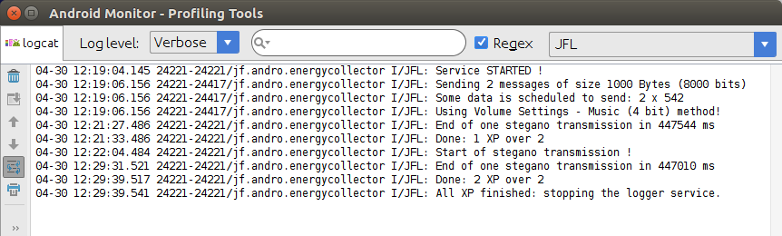

SteganoCC: Covert Channels for Android
===================================================

SteganoCC is a set of programs that helps to experiment with covert channels between two Android colluding applications. Additionally, it also provides a way to collect energy measurements for all Android processes using a modified version of PowerTutor.

This project refers to the implementation of the results of the paper:

- L. Caviglione, M. Gaggero, J.-F. Lalande, and W. Mazurczyk, **Understanding Information Hiding to Secure Communications and to Prevent Exfiltration of Mobile Data,** in Adaptive Mobile Computing: Advances in Processing Mobile Data Sets, M. Migliardi, A. Merlo, and S. Al-Haj Baddar, Eds. Elsevier, 2017, p. To appear.
- M. Urbanski, W. Mazurczyk, J.-F. Lalande, and L. Caviglione, *Detecting Local Covert Channels Using Process Activity Correlation on Android Smartphones,** Int. J. Comput. Syst. Sci. Eng., vol. 32, no. 2, 2017.

News:

- **30-04-2017** Improved documentation
- **14-06-2016** Release v1.1 has been uploaded
- **02-05-2016** Source code is clonable !
- **16-12-2015** Website is online :)

https://gforge.inria.fr/projects/steganocc/

If you have troubles or questions write to jean-francois.lalande__@__insa-cvl.fr.

## Howto

### Getting the code

Get the source code:

```bash
# Clone
git clone https://scm.gforge.inria.fr/anonscm/git/steganocc/steganocc.git

# Change to tranch android-studio
git checkout android-studio
```
Open the project using Android Studio.

The git repository is an Android Studio project, containing multiple apps:

- sender: the Covert Channel sender
- receiver: the Cover Channel receiver
- energyCollector: the Android service that receives the energy measurements from PowerTutor (via Intents)
- powerTutor: the modified version of powerTutor that emits Intents containing the energy consumptions of all applications.

All the analysis of energy with IA methods is not provided here because it is done offline on a desktop computer (more convenient, even if it could have been performed on a smartphone). Thus, the IA code is not provided: only the covert channel implementation and the energy measurement is provided.

### sender / receiver apps

The sender application enables to perform unique experiments with the receiver. By default, the receiver is always active, for all input methods. 

First, you have to select the **type of covert channels** to use in the receiver ("Selected info" in the image below) and the **synchronization method** ("Select sync" in the image below). In the screenshot below, you see the "Volume settings - Music" method for the transmission and the "Content Observer" method for the synchronization. Other possible parameters are the **time interval** for sending data (the lower, the higher speed is obtained) and the **number of time** the experiment is repeated (test iteration).

Then, a message can be sent from the sender to the receiver hitting the "Send message" button and entering some text. Alternatively, an information from the phone (IMEI, contacts, etc.) can be send with the "Send phone state" button. In the receiver application, each received message is displayed. Details about one transmision results is reported (bit rate, accuracy, duration, etc.).


Sender and receiver have several options that can be used. Some of them are buggy or not implemented (in the receiver). The sender have several options to change the settings of covert channels. The **Send after screen goes off** button enables to start the transmission when the screen is switched off. The **Listen for SMS** enables to receive an SMS and start a covert channel transmission between the sender and the receiver with the received message contained in the SMS.


The scenario button is partially implemented (not sure it works !). It helps to execute several transmission implemented in a java code. New scenario can be found in the package **com.steganomobile.common.sender.controller**. In the current code, only scenario 1 is implemented.

### analyser app

Not sure what is the purpose of the Analyzer app. It seems to be very similar to the sender app.

### PowerTutor app

[PowerTutor](http://ziyang.eecs.umich.edu/projects/powertutor/) is a modified version of the original PowerTutor code that reports energy consumption to the EnergyCollector application. To begin collecting energy data, you have to start PowerTutor.


### EnergyCollector app

The EnergyCollector application enables to automatize random transmissions of covert channels and to measure the energy. Thus, the implementation uses a service that waits some random time, then asks to the sender to perform a transmission to the receiver, and then repeat these steps. Parameters of the application are:

- type of covert channels (Volume Music, Volume Ring, etc.)
- the number of XP to perform
- Activate the covert channel transmission or not (in order to make an XP with the same running code but without any transmission)
- Email to use to send a notification when the XP is finished
 
All other applications are controlled using intents and the EnergyCollector code runs in a service.

In the image below on the right, you can see the logcat output filtered on the "JFL" tag. It shows an experiment with 2 messages with the setting "Volume Settings - Music". The experiment last 10 minutes. The main reason is that the 2 messages are sent at a random time during the total experiment duration. Thus, the more message you schedule to be sent, the longer the experiment is.





## Description of Steganography methods

All the implemented methods are located in the **com.steganomobile.lib.Methods** package.

### Volume Settings
Sequence of data is encoded into level of volume. With Music channel there is possibility to send
four bits per iteration. Other channels have eight levels of volume, so we could send three bits per
one iteration.

### Type of Intent
Sender registers some intent actions and receiver sends data with appropriate action.

### Unix Socket Discovery
Sending data through state of socket. Closed socket is equal to one, opened to zero. Closed socket
is detected with Exceptions.

### File Lock
Sender sends one by locking the file. Receiver also is trying to lock file. If he succeeded, he
interprets action as zero. If he get en exception, it means that Sender has locked file before
Receiver attempt. Action equals to one.|

### File Existence
Similar to File Lock. In this case we are checking existence of shared file.

### File Size
Sender sets size of shared file and Receiver interprets it as a byte.

### Memory Load
Receiver gets initial memory load of Sender. Then Sender allocates data, and Receiver compares
current memory load to initial state. Currently not working, cause GC does not deallocate memory,
if we want to allocate less memory than we allocate in previous iteration.

### System Load
Sender sends one by doing a lot of actions on CPU. Receiver check how many clock ticks Sender has
got since previous iteration. If the usage is greater than border usage he interprets it as one.
In the other case he interprets action as zero. Use time interval >= 200 [ms].

### Usage Trend
Similar to System Load, but we are checking trend of measured usage. If usage increases - one.
In other case - zero. Use time interval >= 200 [ms]

### Method's research paper 

| Method                | Article   | Bit rate [b/s] | Synchronous | Detected | ?-Based  |
| --------------------- | :-------: | :------------: | :---------: | :------: | :------: |
| Volume Settings       | 1, 2      | 450            | Yes         | No       | Software |
| Type of Intent        | 1, 3      | 15000          | Yes         | No       | Software |
| Unix Socket Discovery | 1, 2, 3   | 100            | Yes         | No       | Software |
| File Lock             | 2, 3      | 250            | Yes         | No       | Software |
| File Existence        | *         | 250            | Yes         | No       | Software |
| File Size             | *         | 2000           | Yes         | No       | Software |
| Memory Load           | *         | 500            | Yes         | No       | Hardware |
| System Load           | 1, 3      | 5              | Yes         | No       | Hardware |
| Usage Trend           | 1         | 5              | Yes         | No       | Hardware |

[*] Method not used in previous papers

[1] **Analysis of the communication between colluding applications on modern smartphones**
    C. Marforio, H. Ritzdorf, A. Francillon, S. Capkun
    Proceedings of the 28th Annual Computer Security Applications Conference, 51-60

[2] **Soundcomber: A Stealthy and Context- Aware Sound Trojan for Smartphones"**
    R. Schlegel, K. Zhang, X. Zhou, M. Intwala, A. Kapadia, and X.
    Wang, , in Proceedings of Network and Distributed System
    Security Symposium, San Diego, USA: The Internet Society, Feb. 2011.

[3] **Hiding Privacy Leaks in Android Applications Using Low-Attention Raising Covert Channels**
    J.-F. Lalande, S. Wendzel


